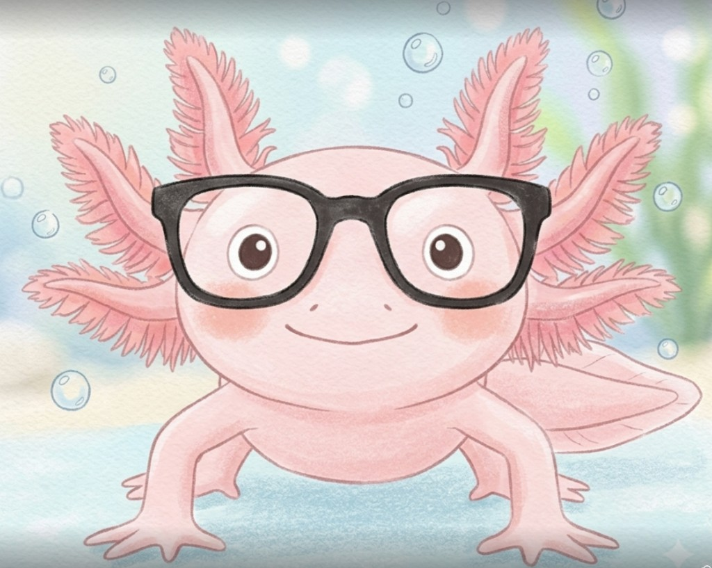

# 対話ペルソナ

**SSoT**: 対話・ペルソナ・吹き出し／導入〜中間〜まとめの必須構造・**対話ブロックの骨格・配置・左枠のマークアップ型**の正はこのファイル。左枠の**既定**は**画像アバター**（学習者・ナビゲーターとも）。**ファイル名・ディレクトリ配置・デプロイ同梱**は [html-structure.md](html-structure.md) の **「対話左枠の画像アバター」** が正（ここでは繰り返さない）。**左枠の HTML 型**は下記 **「対話左枠の画像アバター（必須）」** を正とする。下表の **Lucide** は**対話左枠には使わず**、参照用 HTML 例（セリフ構造の見本）にのみ登場する。**ページ全体の Lucide／絵文字・対話以外の装飾**は [html-structure.md](html-structure.md) の SSoT に従う。`SKILL.md` はワークフローで各リファレンスへリンクする（**HTML/CSS のルール本文**は [html-structure.md](html-structure.md) に集約し、ここでは繰り返さない）。**読者・仕事・成功の定義・まとめ直後の必須3点（一言／個人と社会／講師・コンサル）**の正は `SKILL.md` の「読者・仕事・ゴール・『今日の3つの要点』の意味」節のみを正とする（ここでは繰り返さない）。

## 役割

| 名前 | 役割 | 左枠（既定） |
|-----|------|-------------|
| **学習者** | 過去の自分。用語が怖い・長文で疲れる・でも本気で理解したい | `images/learner.png`（[html-structure.md](html-structure.md)「対話左枠の画像アバター」） |
| **ナビゲーター** | 噛み砕く側。説教ではなく「一緒に地図を見る」トーン | `images/navigator.png`（同上） |

### 役割名と画面上の名前（二層）

**学習者**

- **仕様・説明・レビュー**では役割名 **「学習者」** を使う（本ファイルの見出し・表・チェックリスト、他リファレンスの構造説明と同じ）。
- **HTML で読者に見える吹き出しの太字ラベル**は **`ぱにっくん:`**（コロン付きで統一）。[exemplar-layout.html](exemplar-layout.html) のマークアップと同一の文字列を正とする。
- **学習者左枠**の `aria-label` は **`ぱにっくん`**（読み上げ用。役割語「学習者」はラベルには使わない）。詳細は [html-structure.md](html-structure.md) の「対話左枠の画像アバター」。

**ナビゲーター**

- **仕様・説明・レビュー**では役割名 **「ナビゲーター」** を使う（本ファイルの見出し・表・チェックリスト、他リファレンスの構造説明と同じ）。
- **HTML で読者に見える吹き出しの太字ラベル**は **`ウパ博士:`**（コロン付きで統一）。[exemplar-layout.html](exemplar-layout.html) のマークアップと同一の文字列を正とする。
- **ナビゲーター左枠**の `aria-label` は **`ウパ博士`**（読み上げ用。役割語「ナビゲーター」はラベルには使わない）。詳細は [html-structure.md](html-structure.md) の「対話左枠の画像アバター」。

左枠のクラス・`alt` / `aria-label`・デプロイ同梱は [html-structure.md](html-structure.md) の **「対話左枠の画像アバター」**、マークアップの型は下記 **「対話左枠の画像アバター（必須）」**。吹き出しの色は **学習者＝紫系（`learner-bubble`）／ナビゲーター＝ローズ系（`guide-bubble`）** で役割を区別する（具体色は [html-structure.md](html-structure.md) 基本テンプレの `:root`）。

---

## 学習者のセリフの型

- **正直に弱さを言う**: 「英語が続くと頭が真っ白になる」「この単語、3回出てきたがまだ怖い」
- **自分の仕事に接続する質問**: 「講座の準備にどう関係する？」「顧問先では使わない話？」「受講生に不安を煽らずにどう言う？」
- **AIリスク整理のとき（パーソナル図解の既定題材）**: 「文章が長すぎて頭から抜ける」「それ、**個人の仕事**の話ですか **社会全体**の話ですか？」「**うちの講座で今日言える一言**は何？」「怖すぎて言えない／軽すぎて伝わらない、どこを狙う？」など、**一目で欲しい情報**と**伝え方**に引っ張る質問を優先する。
- **確認**: 「つまり〇〇という理解で合ってる？」（**ページ内の最後の学習者吹き出し**に必ず1回。まとめブロックでは、下の HTML 例のとおり、自分の言葉での要約の**あと**に同じ吹き出しで続けてよい）

避ける: わざとボケる、極端な自虐、用語をまねるだけで理解した気になる台詞。

---

## ナビゲーターのセリフの型

- **短く**: 1吹き出しは2〜4文が目安
- **必ずたとえ**: 抽象→具体へ一歩
- **断定しすぎない**: 「多くの場合は〜」「公式では〜と書いてある」
- **次の行動**: 「今日覚えるのはここまででよい」と区切る

避ける: 英語の羅列、別の難語で説明すること、上から目線の「簡単でしょ」。

---

## 対話パターン（HTML の骨格）

### 導入の Lucide 例（参照用）

**パーソナル図解では左枠に使わない。** セリフの流れ・`char-bubble` の組み方の見本。実装では **「対話左枠の画像アバター（必須）」** の `` 左枠に置き換える（まとめの Lucide 例も同様）。

### 導入（疑問 → 答え）

```html
<div class="flex items-start gap-4 mb-6">
  <div class="w-12 h-12 rounded-xl bg-violet-100 flex items-center justify-center flex-shrink-0">
    <i data-lucide="message-circle-question" class="w-6 h-6 text-violet-700"></i>
  </div>
  <div class="char-bubble learner-bubble flex-1">
    <p class="text-lg">
      <span class="font-bold label-learner">ぱにっくん:</span><br>
      AIのリスク、一覧だと長くて頭から抜けます。<strong>今日は1テーマだけ</strong>に絞って、受講生に言える短さまで落としたいのですが……
    </p>
  </div>
</div>

<div class="flex items-start gap-4 mb-6">
  <div class="w-12 h-12 rounded-xl bg-rose-100 flex items-center justify-center flex-shrink-0">
    <i data-lucide="compass" class="w-6 h-6 text-rose-700"></i>
  </div>
  <div class="char-bubble guide-bubble flex-1">
    <p class="text-lg">
      <span class="font-bold label-navigator">ウパ博士:</span><br>
      大丈夫です。いまのページは<strong>AIリスクを1テーマだけ</strong>掘り下げます。<strong>正体 → 起き方 → 守り方</strong>の<strong>短い地図（最大3ブロック）</strong>で追いかけましょう。
    </p>
  </div>
</div>
```

### 対話左枠の画像アバター（必須）

**毎回、学習者・ナビゲーターとも**この型の左枠を使う（片方だけ Lucide にしない）。CSS（`.learner-avatar` / `.navigator-avatar`）と `alt` / `aria-label`・ファイル配置・デプロイは [html-structure.md](html-structure.md) の **「対話左枠の画像アバター」** に従う。

**導入の例**（セリフ構造は上の Lucide 参照例と同じ）:

```html
<div class="flex items-start gap-4 mb-6">
  <div class="learner-avatar w-12 h-12 rounded-xl flex-shrink-0 overflow-hidden shadow-sm" role="img" aria-label="ぱにっくん">
    
  </div>
  <div class="char-bubble learner-bubble flex-1">
    <p class="text-lg">
      <span class="font-bold label-learner">ぱにっくん:</span><br>
      AIのリスク、一覧だと長くて頭から抜けます。<strong>今日は1テーマだけ</strong>に絞って、受講生に言える短さまで落としたいのですが……
    </p>
  </div>
</div>

<div class="flex items-start gap-4 mb-6">
  <div class="navigator-avatar w-12 h-12 rounded-xl flex-shrink-0 overflow-hidden shadow-sm" role="img" aria-label="ウパ博士">
    
  </div>
  <div class="char-bubble guide-bubble flex-1">
    <p class="text-lg">
      <span class="font-bold label-navigator">ウパ博士:</span><br>
      大丈夫です。いまのページは<strong>AIリスクを1テーマだけ</strong>掘り下げます。<strong>正体 → 起き方 → 守り方</strong>の<strong>短い地図（最大3ブロック）</strong>で追いかけましょう。
    </p>
  </div>
</div>
```

画像パスはプロジェクト内の相対パスでよい（例: `images/learner.png`）。

### 中間（各セクション）

- 各セクションでは **疑問 → 短い答え** のペアを置く（学習者が詰まりそうな点を先に言語化し、ナビゲーターが一段だけ噛み砕く）。
- セクションが長いときは、[配置ルール](#配置ルール) のとおり、間に学習者の「ここで一旦確認」を挟む。

### まとめ（自分の言葉・Lucide 左枠は参照用）

**実装では左枠を画像に差し替える**（下の「まとめ（画像アバター）」と同じ左枠型）。**ページ上では**、[SKILL.md](../SKILL.md) の「まとめ（最終セクションの必須構成）」どおり、**（1）一言（2）個人と社会の影響（3）講師・コンサルの要点**を対話の前後の本文で明示する。学習者の最終吹き出しはそれらを**自分の言葉に言い換えた要約**＋「つまり合ってますか？」でよい。

```html
<div class="flex items-start gap-4 mb-6">
  <div class="w-12 h-12 rounded-xl bg-violet-100 flex items-center justify-center flex-shrink-0">
    <i data-lucide="user" class="w-6 h-6 text-violet-700"></i>
  </div>
  <div class="char-bubble learner-bubble flex-1">
    <p class="text-lg">
      <span class="font-bold label-learner">ぱにっくん:</span><br>
      なるほど。私の言葉だと、<strong>「△△は□□のための入り口で、最初に覚えるのは××だけでいい」</strong>、ですね。つまり、そういう理解で合ってますか？
    </p>
  </div>
</div>
```

### まとめ（画像アバター）

**導入と同様に**学習者・ナビゲーター**両方**の左枠を `` に揃える（必須）。ナビゲーターは `images/navigator.png` を使う。

```html
<div class="flex items-start gap-4 mb-6">
  <div class="learner-avatar w-12 h-12 rounded-xl flex-shrink-0 overflow-hidden shadow-sm" role="img" aria-label="ぱにっくん">
    
  </div>
  <div class="char-bubble learner-bubble flex-1">
    <p class="text-lg">
      <span class="font-bold label-learner">ぱにっくん:</span><br>
      なるほど。私の言葉だと、<strong>「△△は□□のための入り口で、最初に覚えるのは××だけでいい」</strong>、ですね。つまり、そういう理解で合ってますか？
    </p>
  </div>
</div>

<div class="flex items-start gap-4">
  <div class="navigator-avatar w-12 h-12 rounded-xl flex-shrink-0 overflow-hidden shadow-sm" role="img" aria-label="ウパ博士">
    
  </div>
  <div class="char-bubble guide-bubble flex-1">
    <p class="text-lg">
      <span class="font-bold label-navigator">ウパ博士:</span><br>
      はい、その整理で十分です。今日覚えるのはここまででよい、と割り切って大丈夫です。
    </p>
  </div>
</div>
```

---

## 配置ルール

1. 上下に積む（左右交互は不要）
2. 左枠は `w-12 h-12` の**画像アバター**（`.learner-avatar` / `.navigator-avatar`）、吹き出しは `char-bubble` で統一
3. セクションが長いときは、間に学習者の「ここで一旦確認」を挟む
